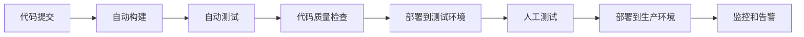

# Trime云同步功能开发计划

## 1. 项目整体规划

### 1.1 项目概述
- **项目名称**: Trime输入法云同步功能开发
- **项目目标**: 实现跨平台配置、用户词典、皮肤主题的云端同步
- **项目周期**: 16周（4个月）
- **团队规模**: 6-8人
- **开发模式**: 敏捷开发，2周一个Sprint

### 1.2 时间线和里程碑

| 阶段 | 时间 | 主要里程碑 | 交付物 |
|------|------|------------|--------|
| 需求分析与设计 | 第1-2周 | 需求文档完成，技术方案确定 | 需求规格说明书、架构设计文档 |
| 核心功能开发 | 第3-8周 | 云同步核心功能完成 | 同步服务API、客户端SDK |
| 平台集成开发 | 第9-12周 | Android/iOS客户端集成完成 | 完整的客户端应用 |
| 测试与优化 | 第13-14周 | 功能测试完成，性能优化 | 测试报告、性能优化方案 |
| 部署与发布 | 第15-16周 | 正式版本发布 | 发布版本、用户文档 |

### 1.3 团队角色和技能要求

| 角色 | 人数 | 主要技能要求 | 职责 |
|------|------|--------------|------|
| 项目经理 | 1 | 敏捷项目管理、团队协调 | 项目规划、进度控制、风险管理 |
| 架构师 | 1 | 分布式系统设计、云服务架构 | 技术方案设计、架构评审 |
| 后端开发 | 2 | Java/Go、RESTful API、数据库设计 | 云同步服务开发、API设计 |
| Android开发 | 1 | Kotlin/Java、Android SDK、网络编程 | Android客户端开发 |
| iOS开发 | 1 | Swift/iOS SDK、网络编程 | iOS客户端开发 |
| 测试工程师 | 1 | 自动化测试、性能测试 | 测试用例设计、质量保证 |
| UI/UX设计师 | 1 | 移动应用设计、用户体验 | 界面设计、交互设计 |

### 1.4 风险评估和应对策略

| 风险类型 | 风险描述 | 影响程度 | 应对策略 |
|----------|----------|----------|----------|
| 技术风险 | 云服务稳定性问题 | 高 | 采用成熟云服务提供商，设计容错机制 |
| 进度风险 | 开发进度延期 | 中 | 采用敏捷开发，每周评估进度，及时调整 |
| 质量风险 | 同步数据丢失或冲突 | 高 | 实现数据备份机制，设计冲突解决策略 |
| 安全风险 | 用户数据泄露 | 高 | 实现端到端加密，定期安全审计 |
| 资源风险 | 关键人员离职 | 中 | 知识文档化，代码审查，交叉培训 |

### 1.5 质量保证和测试策略

#### 测试策略
- **单元测试**: 代码覆盖率≥80%
- **集成测试**: API接口测试，端到端功能测试
- **性能测试**: 并发用户测试，响应时间测试
- **安全测试**: 渗透测试，数据加密验证
- **兼容性测试**: 多设备、多系统版本测试

#### 质量标准
- 代码质量: SonarQube评分≥A级
- 性能指标: API响应时间<500ms，同步成功率≥99.9%
- 安全标准: 通过OWASP安全检查
- 用户体验: 应用启动时间<3秒，界面响应时间<1秒

## 2. 分阶段开发计划

### 2.1 第一阶段：需求分析与设计（第1-2周）

#### 主要任务
1. **需求调研**
   - 用户访谈和问卷调查
   - 竞品分析（主流输入法云同步功能）
   - 功能需求清单整理

2. **技术方案设计**
   - 云同步架构设计
   - 数据模型设计
   - API接口设计
   - 安全方案设计

3. **原型设计**
   - 用户界面原型
   - 交互流程设计
   - 技术验证POC

#### 交付物
- 需求规格说明书
- 技术架构设计文档
- API接口文档
- UI/UX设计稿
- 技术验证报告

#### 技术难点和解决方案
- **难点**: 跨平台数据格式统一
- **方案**: 设计通用的数据序列化格式（JSON/Protocol Buffers）

- **难点**: 离线数据同步冲突处理
- **方案**: 实现基于时间戳和版本号的冲突解决机制

### 2.2 第二阶段：核心功能开发（第3-8周）

#### Sprint 3-4: 云同步服务基础框架
- **任务**:
  - 搭建云服务基础架构
  - 实现用户认证和授权
  - 设计数据存储模型
  - 开发基础API接口

- **交付物**:
  - 云服务基础框架
  - 用户认证API
  - 数据存储服务

#### Sprint 5-6: 数据同步核心功能
- **任务**:
  - 实现配置数据同步
  - 实现用户词典同步
  - 实现皮肤主题同步
  - 开发冲突解决机制

- **交付物**:
  - 数据同步API
  - 冲突解决服务
  - 数据备份恢复功能

#### Sprint 7-8: 客户端SDK开发
- **任务**:
  - 开发Android同步SDK
  - 开发iOS同步SDK
  - 实现离线缓存机制
  - 开发网络状态监控

- **交付物**:
  - Android同步SDK
  - iOS同步SDK
  - SDK使用文档

### 2.3 第三阶段：平台集成开发（第9-12周）

#### Sprint 9-10: Android客户端集成
- **任务**:
  - 集成同步SDK到Trime Android
  - 开发同步设置界面
  - 实现同步状态显示
  - 优化用户体验

- **交付物**:
  - 集成云同步的Android版本
  - 用户设置界面
  - 同步状态管理

#### Sprint 11-12: iOS客户端集成
- **任务**:
  - 集成同步SDK到Trime iOS
  - 开发iOS同步界面
  - 实现跨平台数据一致性
  - 性能优化

- **交付物**:
  - 集成云同步的iOS版本
  - iOS同步界面
  - 跨平台测试报告

### 2.4 第四阶段：测试与优化（第13-14周）

#### 主要任务
1. **功能测试**
   - 端到端功能测试
   - 边界条件测试
   - 异常情况测试

2. **性能测试**
   - 大量数据同步测试
   - 并发用户测试
   - 网络异常情况测试

3. **安全测试**
   - 数据加密验证
   - 认证授权测试
   - 安全漏洞扫描

4. **用户体验优化**
   - 界面响应优化
   - 错误提示优化
   - 用户引导优化

#### 交付物
- 完整测试报告
- 性能优化方案
- 安全测试报告
- 用户体验改进报告

### 2.5 第五阶段：部署与发布（第15-16周）

#### 主要任务
1. **生产环境部署**
   - 云服务生产环境配置
   - 监控和日志系统部署
   - 备份和容灾方案实施

2. **应用发布准备**
   - 应用商店资料准备
   - 用户文档编写
   - 发布版本测试

3. **正式发布**
   - Android应用发布
   - iOS应用发布
   - 用户通知和培训

#### 交付物
- 生产环境部署报告
- 用户使用手册
- 发布版本
- 运维监控方案

## 3. 技术实现路线图

### 3.1 核心功能开发优先级

#### P0（最高优先级）
- 用户认证和授权
- 基础配置数据同步
- 数据冲突解决机制

#### P1（高优先级）
- 用户词典同步
- 皮肤主题同步
- 离线缓存机制

#### P2（中优先级）
- 增量同步优化
- 多设备管理
- 同步历史记录

#### P3（低优先级）
- 数据统计分析
- 高级同步设置
- 第三方账号集成

### 3.2 平台间协调开发策略

#### 技术栈统一
- **后端服务**: Java Spring Boot / Go Gin
- **数据库**: PostgreSQL + Redis
- **消息队列**: RabbitMQ / Apache Kafka
- **存储**: AWS S3 / 阿里云OSS

#### 接口规范
- 统一RESTful API设计规范
- 统一错误码和响应格式
- 统一认证和授权机制
- 统一日志和监控标准

#### 代码管理
- 使用Git进行版本控制
- 采用Git Flow分支管理策略
- 代码审查必须通过才能合并
- 自动化构建和测试

### 3.3 集成测试和部署计划

#### 持续集成流程
1. **代码提交**: 开发者提交代码到feature分支
2. **自动构建**: Jenkins/GitLab CI自动构建
3. **自动测试**: 运行单元测试和集成测试
4. **代码质量检查**: SonarQube代码质量分析
5. **部署到测试环境**: 自动部署到测试环境
6. **人工测试**: QA团队进行功能测试
7. **部署到生产环境**: 通过后部署到生产环境

#### 部署策略
- **蓝绿部署**: 零停机时间部署
- **灰度发布**: 逐步放量，降低风险
- **回滚机制**: 快速回滚到上一版本
- **监控告警**: 实时监控系统状态

### 3.4 文档和培训计划

#### 技术文档
- API接口文档（Swagger/OpenAPI）
- 架构设计文档
- 数据库设计文档
- 部署运维文档
- 故障排查手册

#### 用户文档
- 功能使用说明
- 常见问题解答
- 视频教程
- 最佳实践指南

#### 团队培训
- 技术方案培训
- 开发规范培训
- 测试方法培训
- 运维操作培训

## 4. 项目管理和协作

### 4.1 开发流程和规范

#### 敏捷开发流程
1. **Sprint计划**: 每两周一次Sprint计划会议
2. **每日站会**: 每日15分钟进度同步
3. **Sprint评审**: Sprint结束时演示成果
4. **Sprint回顾**: 总结经验教训，改进流程

#### 代码规范
- **编码规范**: 遵循Google/Apple官方编码规范
- **命名规范**: 使用有意义的变量和函数名
- **注释规范**: 关键逻辑必须添加注释
- **版本规范**: 遵循语义化版本控制（SemVer）

#### Git工作流
```
main分支
├── develop分支
│   ├── feature分支
│   ├── release分支
│   └── hotfix分支
```

### 4.2 代码审查和质量控制

#### 代码审查流程
1. **提交Pull Request**: 开发者提交代码合并请求
2. **自动检查**: 运行自动化测试和代码质量检查
3. **人工审查**: 至少一名资深开发者审查代码
4. **修改完善**: 根据审查意见修改代码
5. **合并代码**: 审查通过后合并到目标分支

#### 质量控制标准
- **代码覆盖率**: 单元测试覆盖率≥80%
- **代码质量**: SonarQube评分≥A级
- **性能标准**: API响应时间<500ms
- **安全标准**: 通过OWASP安全检查

### 4.3 持续集成和部署流程

#### CI/CD工具链
- **版本控制**: GitLab / GitHub
- **持续集成**: Jenkins / GitLab CI
- **容器化**: Docker / Kubernetes
- **监控**: Prometheus + Grafana
- **日志**: ELK Stack (Elasticsearch + Logstash + Kibana)

#### 部署流程


### 4.4 用户反馈和迭代计划

#### 用户反馈收集
- **应用商店评价**: 监控用户评价和评分
- **用户调研**: 定期进行用户满意度调研
- **技术支持**: 收集技术支持工单和问题
- **社区反馈**: 关注GitHub Issues和社区讨论

#### 迭代计划
- **快速修复**: 关键bug 24小时内修复
- **小版本迭代**: 每月发布功能改进版本
- **大版本更新**: 每季度发布重大功能更新
- **长期规划**: 年度产品路线图规划

## 5. 成功标准和验收条件

### 5.1 功能验收标准
- ✅ 用户可以注册和登录云同步账号
- ✅ 配置数据可以在多设备间同步
- ✅ 用户词典可以实时同步更新
- ✅ 皮肤主题可以跨设备使用
- ✅ 网络异常时可以离线使用
- ✅ 数据冲突时可以智能解决

### 5.2 性能验收标准
- ✅ 应用启动时间 < 3秒
- ✅ 同步操作响应时间 < 5秒
- ✅ API接口响应时间 < 500ms
- ✅ 支持并发用户数 > 1000
- ✅ 数据同步成功率 > 99.9%

### 5.3 安全验收标准
- ✅ 用户数据端到端加密
- ✅ 通过OWASP安全检查
- ✅ 定期安全审计无高危漏洞
- ✅ 用户隐私数据合规存储

### 5.4 用户体验验收标准
- ✅ 用户满意度评分 > 4.5/5
- ✅ 应用崩溃率 < 0.1%
- ✅ 用户操作成功率 > 95%
- ✅ 客服问题解决率 > 90%

## 6. 项目预算和资源需求

### 6.1 人力资源成本
| 角色 | 人数 | 月薪(万元) | 总成本(万元) |
|------|------|------------|--------------|
| 项目经理 | 1 | 2.5 | 10 |
| 架构师 | 1 | 3.0 | 12 |
| 后端开发 | 2 | 2.0 | 16 |
| Android开发 | 1 | 1.8 | 7.2 |
| iOS开发 | 1 | 1.8 | 7.2 |
| 测试工程师 | 1 | 1.5 | 6 |
| UI/UX设计师 | 1 | 1.6 | 6.4 |
| **合计** | **8** | **-** | **64.8** |

### 6.2 基础设施成本
| 项目 | 月费用(万元) | 总费用(万元) |
|------|--------------|--------------|
| 云服务器 | 0.5 | 2 |
| 数据库服务 | 0.3 | 1.2 |
| 存储服务 | 0.2 | 0.8 |
| CDN服务 | 0.1 | 0.4 |
| 监控服务 | 0.1 | 0.4 |
| **合计** | **1.2** | **4.8** |

### 6.3 总项目预算
- **人力成本**: 64.8万元
- **基础设施成本**: 4.8万元
- **其他费用**（培训、差旅等）: 5万元
- **风险缓冲**（10%）: 7.46万元
- **项目总预算**: **82.06万元**

## 7. 风险管理和应急预案

### 7.1 技术风险应急预案
- **云服务故障**: 启用备用云服务提供商
- **数据丢失**: 实施多重备份策略
- **性能问题**: 准备性能优化方案
- **安全漏洞**: 建立安全应急响应流程

### 7.2 项目风险应急预案
- **关键人员离职**: 建立知识库和交叉培训机制
- **进度延期**: 准备功能优先级调整方案
- **质量问题**: 建立快速修复和回滚机制
- **预算超支**: 准备成本控制和范围调整方案

### 7.3 业务风险应急预案
- **用户接受度低**: 准备用户教育和推广方案
- **竞争对手压力**: 建立差异化竞争优势
- **政策法规变化**: 关注合规要求，及时调整
- **市场需求变化**: 保持产品灵活性，快速响应

---

**项目启动日期**: 2026年1月19日  
**预计完成日期**: 2026年5月19日  
**项目负责人**: [待定]  
**技术负责人**: [待定]  

本计划将根据项目进展情况定期更新和调整，确保项目按时、按质量、按预算完成。