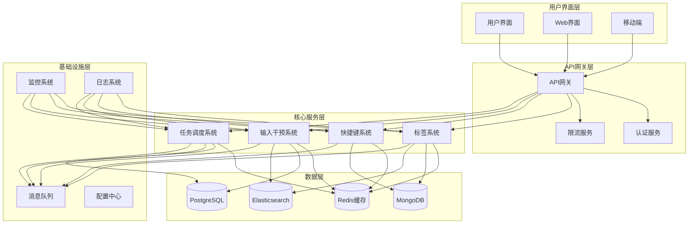

# 系统集成架构设计

## 1. 整体架构概览

### 1.1 系统架构图



### 1.2 核心组件关系

```typescript
// 系统核心接口
interface SystemCore {
  tagSystem: TagSystem;
  hotkeySystem: HotkeySystem;
  inputSystem: InputInterventionSystem;
  taskSystem: TaskSchedulingSystem;
  eventBus: EventBus;
  dataManager: DataManager;
  configManager: ConfigManager;
}

// 事件总线
interface EventBus {
  // 发布事件
  publish(event: SystemEvent): Promise<void>;
  
  // 订阅事件
  subscribe(eventType: string, handler: EventHandler): Subscription;
  
  // 取消订阅
  unsubscribe(subscription: Subscription): void;
  
  // 事件路由
  route(event: SystemEvent): Promise<void>;
}

// 系统事件
interface SystemEvent {
  id: string;
  type: string;
  source: string;
  timestamp: Date;
  data: any;
  metadata: EventMetadata;
}

// 事件处理器
type EventHandler = (event: SystemEvent) => Promise<void>;
```

## 2. 数据集成设计

### 2.1 统一数据模型

```typescript
// 统一实体基类
abstract class BaseEntity {
  id: string;
  createdAt: Date;
  updatedAt: Date;
  version: number;
  metadata: EntityMetadata;
  
  abstract getType(): EntityType;
  abstract toDTO(): EntityDTO;
  abstract fromDTO(dto: EntityDTO): void;
}

// 实体类型
enum EntityType {
  TAG = 'tag',
  HOTKEY = 'hotkey',
  MACRO = 'macro',
  TASK = 'task',
  USER = 'user',
  CONTENT = 'content'
}

// 实体元数据
interface EntityMetadata {
  source: string;
  tags: string[];
  permissions: Permission[];
  audit: AuditInfo;
}

// 数据访问对象接口
interface Repository<T extends BaseEntity> {
  findById(id: string): Promise<T | null>;
  findAll(filter?: Filter): Promise<T[]>;
  save(entity: T): Promise<T>;
  delete(id: string): Promise<void>;
  search(query: SearchQuery): Promise<SearchResult<T>>;
}

// 统一数据管理器
class UnifiedDataManager {
  private repositories: Map<EntityType, Repository<any>>;
  private cacheManager: CacheManager;
  private transactionManager: TransactionManager;
  
  constructor() {
    this.repositories = new Map();
    this.setupRepositories();
  }
  
  private setupRepositories(): void {
    // 标签仓库
    this.repositories.set(EntityType.TAG, new TagRepository());
    
    // 快捷键仓库
    this.repositories.set(EntityType.HOTKEY, new HotkeyRepository());
    
    // 任务仓库
    this.repositories.set(EntityType.TASK, new TaskRepository());
  }
  
  async save<T extends BaseEntity>(entity: T): Promise<T> {
    // 1. 验证实体
    await this.validateEntity(entity);
    
    // 2. 开始事务
    const transaction = await this.transactionManager.beginTransaction();
    
    try {
      // 3. 保存实体
      const repository = this.repositories.get(entity.getType());
      const saved = await repository.save(entity);
      
      // 4. 更新缓存
      await this.cacheManager.set(saved.id, saved);
      
      // 5. 提交事务
      await transaction.commit();
      
      // 6. 发布事件
      await this.publishEntityEvent('entity.saved', saved);
      
      return saved;
    } catch (error) {
      await transaction.rollback();
      throw error;
    }
  }
}
```

### 2.2 数据同步机制

```typescript
// 数据同步管理器
class DataSyncManager {
  private syncStrategies: Map<SyncType, SyncStrategy>;
  private conflictResolver: ConflictResolver;
  private syncQueue: Queue<SyncTask>;
  
  constructor() {
    this.setupSyncStrategies();
    this.setupConflictResolution();
  }
  
  async syncData(syncRequest: SyncRequest): Promise<SyncResult> {
    // 1. 选择同步策略
    const strategy = this.selectSyncStrategy(syncRequest);
    
    // 2. 执行同步
    const result = await strategy.execute(syncRequest);
    
    // 3. 处理冲突
    if (result.conflicts.length > 0) {
      const resolved = await this.conflictResolver.resolve(result.conflicts);
      result.resolvedConflicts = resolved;
    }
    
    // 4. 更新同步状态
    await this.updateSyncStatus(syncRequest.id, result);
    
    return result;
  }
  
  private selectSyncStrategy(request: SyncRequest): SyncStrategy {
    switch (request.type) {
      case SyncType.REAL_TIME:
        return this.syncStrategies.get(SyncType.REAL_TIME)!;
      case SyncType.BATCH:
        return this.syncStrategies.get(SyncType.BATCH)!;
      case SyncType.DELTA:
        return this.syncStrategies.get(SyncType.DELTA)!;
      default:
        throw new Error(`Unknown sync type: ${request.type}`);
    }
  }
}

// 同步类型
enum SyncType {
  REAL_TIME = 'real_time',
  BATCH = 'batch',
  DELTA = 'delta',
  FULL = 'full'
}

// 实时同步策略
class RealTimeSyncStrategy implements SyncStrategy {
  private eventBus: EventBus;
  private changeDetector: ChangeDetector;
  
  async execute(request: SyncRequest): Promise<SyncResult> {
    const result = new SyncResult();
    
    // 1. 监听数据变化
    const subscription = await this.eventBus.subscribe(
      'data.changed',
      this.handleDataChange.bind(this, request, result)
    );
    
    // 2. 执行初始同步
    await this.performInitialSync(request, result);
    
    // 3. 保持同步连接
    await this.maintainSyncConnection(request, result);
    
    // 4. 清理资源
    subscription.unsubscribe();
    
    return result;
  }
  
  private async handleDataChange(
    request: SyncRequest,
    result: SyncResult,
    event: DataChangedEvent
  ): Promise<void> {
    // 处理数据变化
    const change = event.data;
    
    if (this.shouldSync(change, request)) {
      await this.applyChange(change, request);
      result.addSyncedChange(change);
    }
  }
}
```

## 3. 服务集成设计

### 3.1 微服务架构

```typescript
// 服务注册中心
class ServiceRegistry {
  private services: Map<string, ServiceInfo>;
  private healthChecker: HealthChecker;
  private loadBalancer: LoadBalancer;
  
  constructor() {
    this.services = new Map();
    this.setupHealthChecking();
  }
  
  registerService(service: ServiceInfo): void {
    this.services.set(service.name, service);
    
    // 设置健康检查
    this.healthChecker.addCheck(service.name, service.healthEndpoint);
  }
  
  async getServiceInstance(serviceName: string): Promise<ServiceInstance | null> {
    const service = this.services.get(serviceName);
    if (!service) {
      return null;
    }
    
    // 获取健康的实例
    const healthyInstances = await this.healthChecker.getHealthyInstances(serviceName);
    
    if (healthyInstances.length === 0) {
      return null;
    }
    
    // 负载均衡选择实例
    return this.loadBalancer.select(healthyInstances);
  }
}

// 服务信息
interface ServiceInfo {
  name: string;
  version: string;
  instances: ServiceInstance[];
  healthEndpoint: string;
  metadata: ServiceMetadata;
}

// 服务实例
interface ServiceInstance {
  id: string;
  host: string;
  port: number;
  protocol: 'http' | 'https';
  health: HealthStatus;
  metadata: InstanceMetadata;
}

// 服务客户端基类
abstract class ServiceClient {
  protected serviceName: string;
  protected registry: ServiceRegistry;
  protected circuitBreaker: CircuitBreaker;
  
  constructor(serviceName: string, registry: ServiceRegistry) {
    this.serviceName = serviceName;
    this.registry = registry;
    this.circuitBreaker = new CircuitBreaker({
      timeout: 5000,
      errorThreshold: 0.5,
      resetTimeout: 30000
    });
  }
  
  protected async call<T>(
    method: string,
    path: string,
    data?: any,
    options?: RequestOptions
  ): Promise<T> {
    return this.circuitBreaker.execute(async () => {
      const instance = await this.registry.getServiceInstance(this.serviceName);
      if (!instance) {
        throw new Error(`Service ${this.serviceName} is not available`);
      }
      
      const url = `${instance.protocol}://${instance.host}:${instance.port}${path}`;
      
      const response = await fetch(url, {
        method,
        headers: {
          'Content-Type': 'application/json',
          ...options?.headers
        },
        body: data ? JSON.stringify(data) : undefined,
        ...options
      });
      
      if (!response.ok) {
        throw new ServiceError(response.status, response.statusText);
      }
      
      return response.json();
    });
  }
}

// 标签系统客户端
class TagSystemServiceClient extends ServiceClient {
  constructor(registry: ServiceRegistry) {
    super('tag-system', registry);
  }
  
  async createTag(tag: CreateTagRequest): Promise<Tag> {
    return this.call<Tag>('POST', '/api/tags', tag);
  }
  
  async searchTags(query: string): Promise<Tag[]> {
    return this.call<Tag[]>('GET', `/api/tags/search?q=${encodeURIComponent(query)}`);
  }
  
  async getRecommendations(content: string): Promise<RecommendedTag[]> {
    return this.call<RecommendedTag[]>('POST', '/api/tags/recommendations', {
      content
    });
  }
}
```

### 3.2 API网关设计

```typescript
// API网关
class APIGateway {
  private router: Router;
  private authMiddleware: AuthMiddleware;
  private rateLimitMiddleware: RateLimitMiddleware;
  private loggingMiddleware: LoggingMiddleware;
  private serviceRegistry: ServiceRegistry;
  
  constructor() {
    this.setupMiddleware();
    this.setupRoutes();
  }
  
  private setupMiddleware(): void {
    // 认证中间件
    this.authMiddleware = new AuthMiddleware({
      jwtSecret: process.env.JWT_SECRET!,
      tokenCache: new TokenCache()
    });
    
    // 限流中间件
    this.rateLimitMiddleware = new RateLimitMiddleware({
      windowMs: 15 * 60 * 1000, // 15分钟
      max: 100, // 最多100个请求
      message: 'Too many requests'
    });
    
    // 日志中间件
    this.loggingMiddleware = new LoggingMiddleware({
      logger: new GatewayLogger()
    });
  }
  
  private setupRoutes(): void {
    // 标签系统路由
    this.router.route('/api/tags/*')
      .all(this.authMiddleware.handle.bind(this.authMiddleware))
      .all(this.rateLimitMiddleware.handle.bind(this.rateLimitMiddleware))
      .all(this.loggingMiddleware.handle.bind(this.loggingMiddleware))
      .proxyTo('tag-system');
    
    // 快捷键系统路由
    this.router.route('/api/hotkeys/*')
      .all(this.authMiddleware.handle.bind(this.authMiddleware))
      .all(this.rateLimitMiddleware.handle.bind(this.rateLimitMiddleware))
      .proxyTo('hotkey-system');
    
    // 输入干预系统路由
    this.router.route('/api/input/*')
      .all(this.authMiddleware.handle.bind(this.authMiddleware))
      .all(this.rateLimitMiddleware.handle.bind(this.rateLimitMiddleware))
      .proxyTo('input-system');
    
    // 任务系统路由
    this.router.route('/api/tasks/*')
      .all(this.authMiddleware.handle.bind(this.authMiddleware))
      .all(this.rateLimitMiddleware.handle.bind(this.rateLimitMiddleware))
      .proxyTo('task-system');
  }
  
  async handleRequest(request: Request): Promise<Response> {
    try {
      // 路由请求
      const route = this.router.match(request.url);
      
      if (!route) {
        return new Response('Not Found', { status: 404 });
      }
      
      // 执行中间件链
      return await this.executeMiddlewareChain(request, route);
    } catch (error) {
      return this.handleError(error);
    }
  }
  
  private async executeMiddlewareChain(
    request: Request,
    route: Route
  ): Promise<Response> {
    let currentRequest = request;
    
    // 执行中间件
    for (const middleware of route.middlewares) {
      currentRequest = await middleware.handle(currentRequest);
    }
    
    // 代理到目标服务
    return await this.proxyToService(currentRequest, route.serviceName);
  }
}
```

## 4. 事件驱动架构

### 4.1 事件系统设计

```typescript
// 分布式事件总线
class DistributedEventBus implements EventBus {
  private messageBroker: MessageBroker;
  private eventSerializer: EventSerializer;
  private eventStore: EventStore;
  private subscribers: Map<string, EventHandler[]>;
  
  constructor() {
    this.subscribers = new Map();
    this.setupMessageBroker();
  }
  
  async publish(event: SystemEvent): Promise<void> {
    // 1. 序列化事件
    const serialized = await this.eventSerializer.serialize(event);
    
    // 2. 存储事件
    await this.eventStore.save(event);
    
    // 3. 发布到消息队列
    await this.messageBroker.publish(event.type, serialized);
    
    // 4. 本地订阅者处理
    await this.notifyLocalSubscribers(event);
  }
  
  subscribe(eventType: string, handler: EventHandler): Subscription {
    if (!this.subscribers.has(eventType)) {
      this.subscribers.set(eventType, []);
    }
    
    this.subscribers.get(eventType)!.push(handler);
    
    return {
      id: generateId(),
      eventType,
      unsubscribe: () => this.unsubscribe(eventType, handler)
    };
  }
  
  private async notifyLocalSubscribers(event: SystemEvent): Promise<void> {
    const handlers = this.subscribers.get(event.type) || [];
    
    await Promise.allSettled(
      handlers.map(handler => handler(event))
    );
  }
  
  private setupMessageBroker(): void {
    this.messageBroker = new MessageBroker({
      broker: 'redis',
      options: {
        host: process.env.REDIS_HOST,
        port: parseInt(process.env.REDIS_PORT || '6379')
      }
    });
    
    // 监听外部事件
    this.messageBroker.subscribe('*', this.handleExternalEvent.bind(this));
  }
  
  private async handleExternalEvent(message: Message): Promise<void> {
    try {
      const event = await this.eventSerializer.deserialize(message.data);
      await this.notifyLocalSubscribers(event);
    } catch (error) {
      console.error('Failed to handle external event:', error);
    }
  }
}

// 事件处理器装饰器
function EventHandler(eventType: string) {
  return function (target: any, propertyKey: string, descriptor: PropertyDescriptor) {
    const method = descriptor.value;
    
    descriptor.value = async function (...args: any[]) {
      const event = args[0] as SystemEvent;
      
      // 事件处理前钩子
      await this.beforeEventHandler?.(eventType, event);
      
      // 执行处理方法
      const result = await method.apply(this, args);
      
      // 事件处理后钩子
      await this.afterEventHandler?.(eventType, event, result);
      
      return result;
    };
    
    // 注册事件处理器
    if (!target._eventHandlers) {
      target._eventHandlers = [];
    }
    target._eventHandlers.push({ eventType, method: propertyKey });
  };
}

// 使用示例
class TagService {
  @EventHandler('content.created')
  async handleContentCreated(event: ContentCreatedEvent): Promise<void> {
    // 自动标签推荐
    const recommendations = await this.getRecommendations(event.content);
    
    // 发布推荐事件
    await this.eventBus.publish({
      type: 'tag.recommended',
      source: 'tag-system',
      data: {
        contentId: event.contentId,
        recommendations
      }
    });
  }
  
  @EventHandler('user.tag.accepted')
  async handleTagAccepted(event: TagAcceptedEvent): Promise<void> {
    // 更新标签使用统计
    await this.updateTagUsage(event.tagId, event.userId);
    
    // 学习用户偏好
    await this.learnUserPreference(event.userId, event.tagId);
  }
}
```

### 4.2 事件溯源

```typescript
// 事件存储
class EventStore {
  private storage: EventStorage;
  private snapshotManager: SnapshotManager;
  private eventSerializer: EventSerializer;
  
  constructor() {
    this.storage = new EventStorage();
    this.snapshotManager = new SnapshotManager();
  }
  
  async saveEvent(event: SystemEvent): Promise<void> {
    // 1. 验证事件
    await this.validateEvent(event);
    
    // 2. 序列化事件
    const serialized = await this.eventSerializer.serialize(event);
    
    // 3. 存储事件
    await this.storage.append(event);
    
    // 4. 检查是否需要快照
    if (await this.shouldCreateSnapshot(event)) {
      await this.createSnapshot(event);
    }
  }
  
  async getEvents(aggregateId: string, fromVersion?: number): Promise<SystemEvent[]> {
    // 1. 检查快照
    const snapshot = await this.snapshotManager.getLatest(aggregateId);
    
    if (snapshot && (!fromVersion || snapshot.version >= fromVersion)) {
      // 从快照开始重建
      const events = await this.storage.getEvents(
        aggregateId, 
        snapshot.version + 1
      );
      
      return [snapshot.event, ...events];
    } else {
      // 从头开始获取
      return await this.storage.getEvents(aggregateId, fromVersion);
    }
  }
  
  async replayEvents(aggregateId: string, handler: EventHandler): Promise<void> {
    const events = await this.getEvents(aggregateId);
    
    for (const event of events) {
      await handler(event);
    }
  }
}

// 聚合根基类
abstract class AggregateRoot {
  private id: string;
  private version: number;
  private uncommittedEvents: SystemEvent[] = [];
  
  constructor(id: string) {
    this.id = id;
    this.version = 0;
  }
  
  protected applyEvent(event: SystemEvent): void {
    // 应用事件
    this.when(event);
    
    // 添加到未提交事件
    this.uncommittedEvents.push(event);
    
    // 增加版本
    this.version++;
  }
  
  abstract when(event: SystemEvent): void;
  
  getUncommittedEvents(): SystemEvent[] {
    return [...this.uncommittedEvents];
  }
  
  markEventsAsCommitted(): void {
    this.uncommittedEvents = [];
  }
}

// 标签聚合
class TagAggregate extends AggregateRoot {
  private name: string;
  private description?: string;
  private usage: TagUsage;
  
  constructor(id: string, name: string) {
    super(id);
    this.name = name;
    this.usage = { count: 0, frequency: 0 };
  }
  
  when(event: SystemEvent): void {
    switch (event.type) {
      case 'tag.created':
        this.handleTagCreated(event as TagCreatedEvent);
        break;
      case 'tag.used':
        this.handleTagUsed(event as TagUsedEvent);
        break;
      case 'tag.updated':
        this.handleTagUpdated(event as TagUpdatedEvent);
        break;
    }
  }
  
  private handleTagCreated(event: TagCreatedEvent): void {
    this.name = event.data.name;
    this.description = event.data.description;
  }
  
  private handleTagUsed(event: TagUsedEvent): void {
    this.usage.count++;
    this.usage.frequency = this.calculateFrequency();
  }
  
  useTag(userId: string): void {
    this.applyEvent({
      type: 'tag.used',
      source: 'tag-system',
      data: {
        tagId: this.id,
        userId,
        timestamp: new Date()
      }
    });
  }
}
```

## 5. 配置管理

### 5.1 统一配置中心

```typescript
// 配置中心
class ConfigCenter {
  private configStore: ConfigStore;
  private configWatcher: ConfigWatcher;
  private configValidator: ConfigValidator;
  private configCache: ConfigCache;
  
  constructor() {
    this.setupConfigStore();
    this.setupConfigWatcher();
  }
  
  async getConfig<T>(key: string, defaultValue?: T): Promise<T> {
    // 1. 检查缓存
    const cached = await this.configCache.get<T>(key);
    if (cached !== undefined) {
      return cached;
    }
    
    // 2. 从存储获取
    const config = await this.configStore.get<T>(key);
    
    // 3. 验证配置
    if (config) {
      await this.configValidator.validate(key, config);
    }
    
    // 4. 缓存配置
    const value = config || defaultValue;
    await this.configCache.set(key, value);
    
    return value;
  }
  
  async setConfig<T>(key: string, value: T): Promise<void> {
    // 1. 验证配置
    await this.configValidator.validate(key, value);
    
    // 2. 存储配置
    await this.configStore.set(key, value);
    
    // 3. 更新缓存
    await this.configCache.set(key, value);
    
    // 4. 发布配置变更事件
    await this.publishConfigChangeEvent(key, value);
  }
  
  watchConfig<T>(key: string, callback: ConfigChangeCallback<T>): void {
    this.configWatcher.watch(key, callback);
  }
  
  private async publishConfigChangeEvent<T>(key: string, value: T): Promise<void> {
    await this.eventBus.publish({
      type: 'config.changed',
      source: 'config-center',
      data: {
        key,
        value,
        timestamp: new Date()
      }
    });
  }
}

// 配置模式
interface ConfigSchema {
  [key: string]: ConfigProperty;
}

interface ConfigProperty {
  type: 'string' | 'number' | 'boolean' | 'object' | 'array';
  required?: boolean;
  default?: any;
  validation?: ValidationRule[];
  description?: string;
}

// 系统配置模式
const SYSTEM_CONFIG_SCHEMA: ConfigSchema = {
  'tag-system.max-tags-per-content': {
    type: 'number',
    required: true,
    default: 50,
    validation: [
      { type: 'min', value: 1 },
      { type: 'max', value: 1000 }
    ],
    description: '每个内容最多可添加的标签数量'
  },
  
  'hotkey-system.global-hotkeys-enabled': {
    type: 'boolean',
    required: true,
    default: true,
    description: '是否启用全局快捷键'
  },
  
  'input-system.auto-correction-enabled': {
    type: 'boolean',
    required: true,
    default: true,
    description: '是否启用自动纠错'
  },
  
  'task-system.max-concurrent-tasks': {
    type: 'number',
    required: true,
    default: 10,
    validation: [
      { type: 'min', value: 1 },
      { type: 'max', value: 100 }
    ],
    description: '最大并发任务数量'
  }
};
```

### 5.2 环境配置管理

```typescript
// 环境配置管理器
class EnvironmentConfigManager {
  private environments: Map<string, EnvironmentConfig>;
  private currentEnvironment: string;
  
  constructor() {
    this.loadEnvironments();
    this.detectCurrentEnvironment();
  }
  
  private loadEnvironments(): void {
    // 加载各环境配置
    this.environments.set('development', {
      name: 'Development',
      database: {
        host: 'localhost',
        port: 5432,
        name: 'dev_db'
      },
      redis: {
        host: 'localhost',
        port: 6379
      },
      features: {
        debugMode: true,
        detailedLogging: true,
        hotReload: true
      }
    });
    
    this.environments.set('production', {
      name: 'Production',
      database: {
        host: process.env.DB_HOST!,
        port: parseInt(process.env.DB_PORT || '5432'),
        name: process.env.DB_NAME!
      },
      redis: {
        host: process.env.REDIS_HOST!,
        port: parseInt(process.env.REDIS_PORT || '6379')
      },
      features: {
        debugMode: false,
        detailedLogging: false,
        hotReload: false
      }
    });
  }
  
  getCurrentConfig(): EnvironmentConfig {
    return this.environments.get(this.currentEnvironment)!;
  }
  
  isFeatureEnabled(feature: string): boolean {
    const config = this.getCurrentConfig();
    return config.features[feature] || false;
  }
}

// 环境配置
interface EnvironmentConfig {
  name: string;
  database: DatabaseConfig;
  redis: RedisConfig;
  features: FeatureFlags;
  services: ServiceConfig;
}

// 功能开关
interface FeatureFlags {
  [featureName: string]: boolean;
}

// 功能开关管理器
class FeatureFlagManager {
  private flags: Map<string, FeatureFlag>;
  private rolloutManager: RolloutManager;
  
  constructor() {
    this.loadFeatureFlags();
  }
  
  isEnabled(featureName: string, context?: FeatureContext): boolean {
    const flag = this.flags.get(featureName);
    if (!flag) {
      return false;
    }
    
    return this.rolloutManager.isEnabled(flag, context);
  }
  
  async enableFeature(featureName: string, rolloutPercentage?: number): Promise<void> {
    const flag = this.flags.get(featureName);
    if (flag) {
      flag.enabled = true;
      if (rolloutPercentage) {
        flag.rolloutPercentage = rolloutPercentage;
      }
      
      await this.saveFeatureFlag(flag);
    }
  }
  
  private loadFeatureFlags(): void {
    this.flags.set('smart-tag-recommendation', {
      name: 'Smart Tag Recommendation',
      enabled: true,
      rolloutPercentage: 100,
      conditions: [
        { type: 'user-tier', value: 'premium' }
      ]
    });
    
    this.flags.set('voice-commands', {
      name: 'Voice Commands',
      enabled: true,
      rolloutPercentage: 20,
      conditions: [
        { type: 'platform', value: 'desktop' }
      ]
    });
  }
}
```

这个系统集成架构设计提供了完整的微服务架构、事件驱动、数据同步、配置管理等功能，确保各系统之间的高效协作和数据一致性。